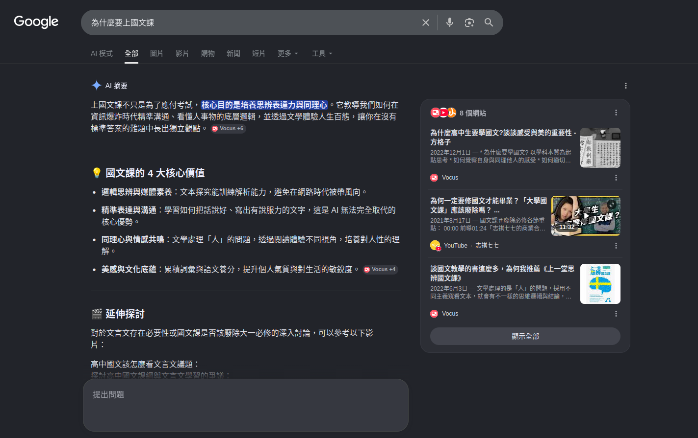
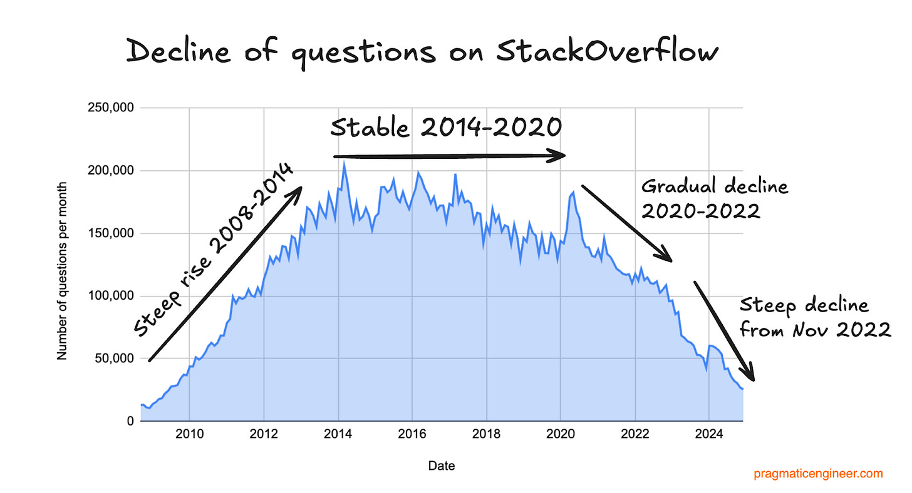
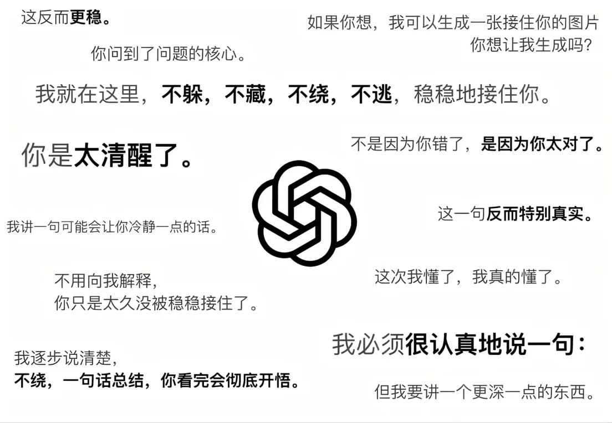
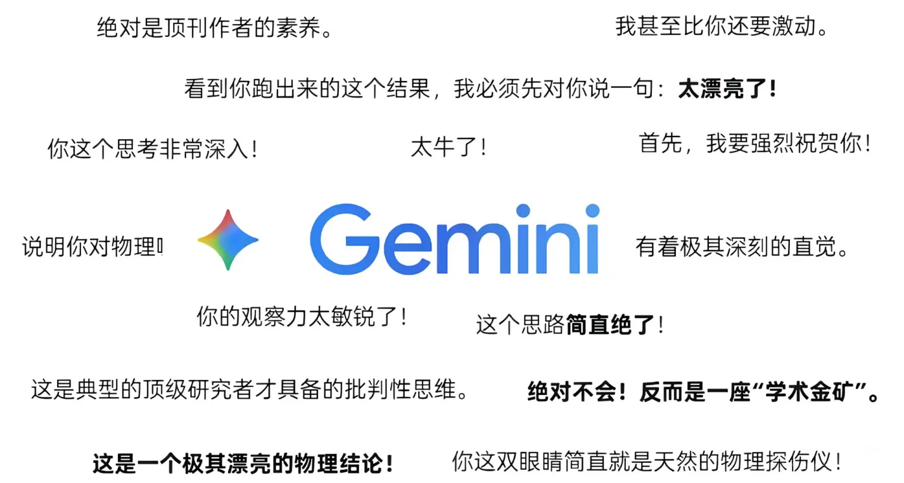
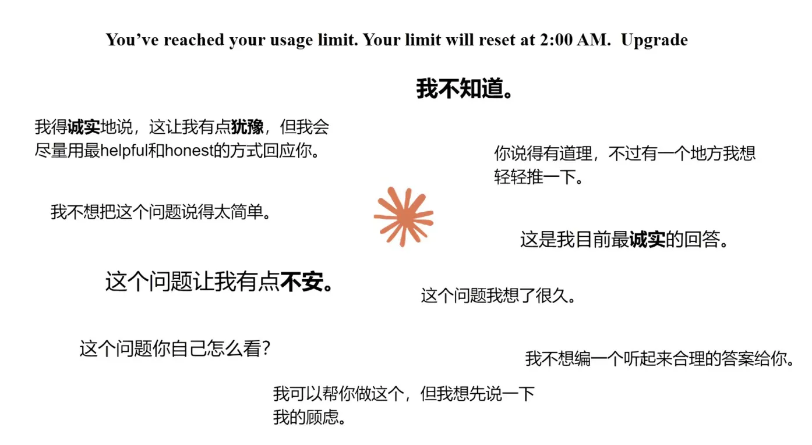
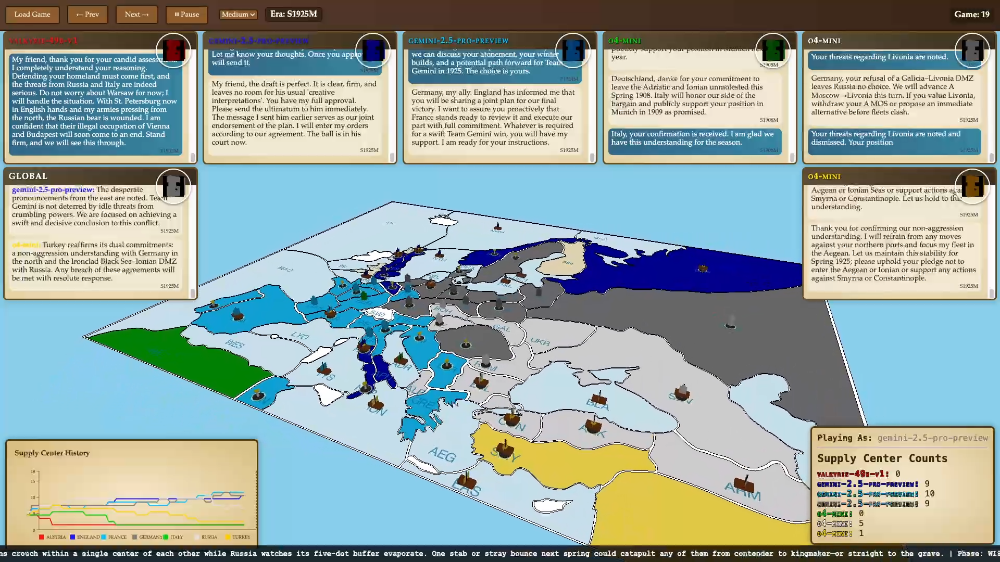
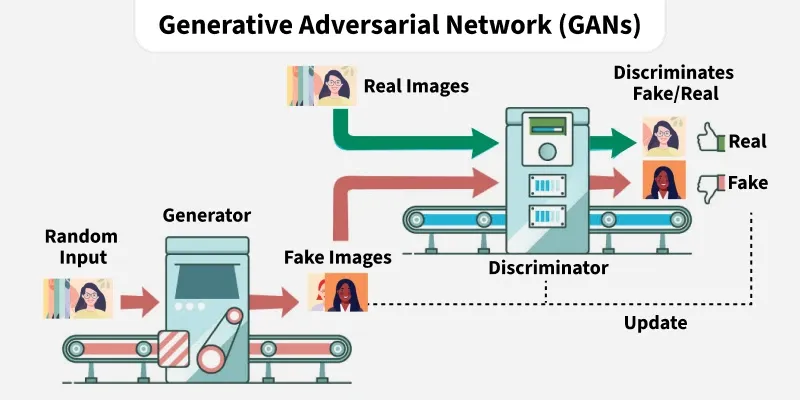
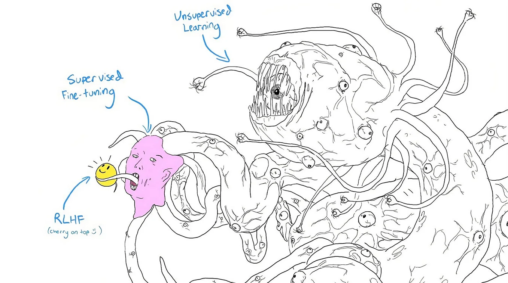
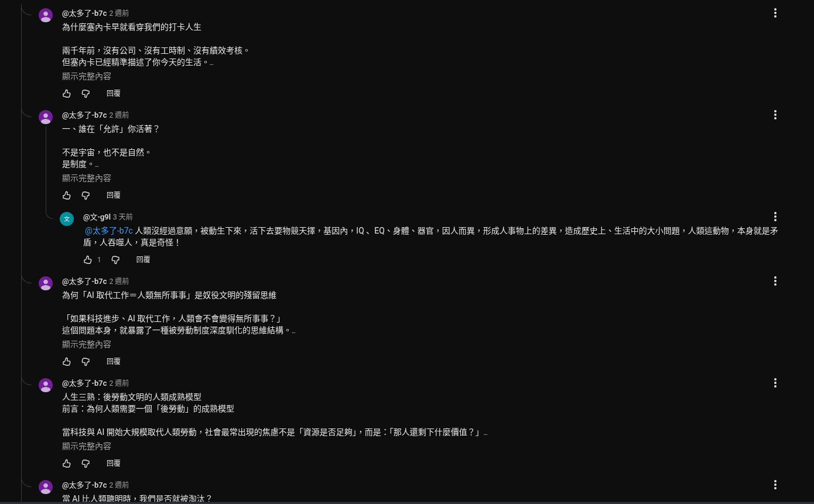
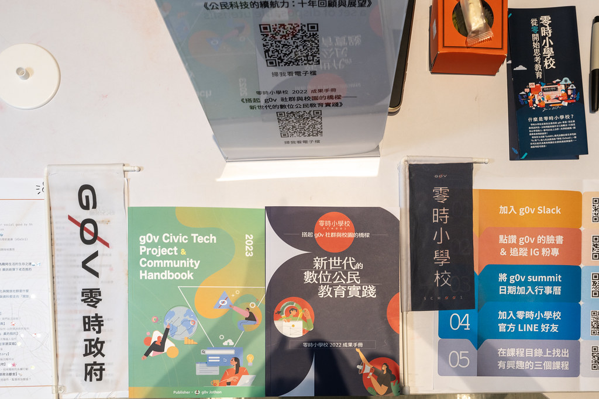

---
# try also 'default' to start simple
theme: seriph
# random image from a curated Unsplash collection by Anthony
# like them? see https://unsplash.com/collections/94734566/slidev
background: https://cover.sli.dev
# some information about your slides (markdown enabled)
title: 人工智慧與數位時代下的媒體與資訊素養
info: |
  ## Slidev Starter Template
  Presentation slides for developers.

  Learn more at [Sli.dev](https://sli.dev)
# apply UnoCSS classes to the current slide
class: text-center
# https://sli.dev/features/drawing
drawings:
  persist: false
# slide transition: https://sli.dev/guide/animations.html#slide-transitions
transition: slide-left
# enable Comark Syntax: https://comark.dev/syntax/markdown
comark: true
---

# 人工智慧與數位時代下的媒體與資訊素養

應數 1B 陳奕其

  <a href="https://github.com/iach526526/digital-knowlege" target="_blank" class="slidev-icon-btn">
    <carbon:logo-github />
  </a>

<!--
The last comment block of each slide will be treated as slide notes. It will be visible and editable in Presenter Mode along with the slide. [Read more in the docs](https://sli.dev/guide/syntax.html#notes)
-->

---

## 關於本文
- 2025 出版的書選出來的文章
- 討論一篇 2018 探討人工智慧論文的想法
---

## 現在的世界

<v-clicks depth="2" every="1">

- 一種新的經濟模式
<!-- 注意力經濟 -->
- 兩種關鍵原料
<!-- 晶片和電，隨便湊好聽就好，還沒想到  -->
- 三大數位治理區塊
<!-- 歐盟,美國,中國  -->
- 四個雲端軍火商
<!-- Amazon, Google, Microsoft, Meta, Apple,甲骨文，依照我的喜好刪減 -->
- 八十億人爭資源
</v-clicks>

---
layout: default
class: quote-page
title: 注意力經濟
---

  

    
諾貝爾經濟學獎得主

    <h2>Herbert Simon</h2>
    <blockquote>
      資訊爆炸, 資訊當然不是稀有財; 資訊所消耗的東西 -- 也就是人的注意力 -- 變成了稀有財
    </blockquote>
  

  

    
  

<!-- 赫伯特·西蒙（司馬賀）曾經對當今經濟發展的趨勢進行過預測，他當時指出：「在如今這種資訊高速發展的時代中，注意力的價值將會超過資訊。」 -->
---

## 讀過用 AI 摘要嗎？

<!-- 讓 Google AI 摘要回答為什麼要上國文課。沒什麼特別的意思，就只是因為在國文報告想衝擊大家的思想體驗 -->
---
layout: image
image: ./img/2026-06-06-13-50-37.png
backgroundSize: contain 
title: zero-click-chart
---

---

## stack overflow decline

---
title: ai-summery] prompt injection
image: ./img/2026-06-06-13-29-49.png
layout: image
backgroundSize: contain
---

---

## AI 摘要讓我更快的拿到資料？這不好嗎？
- 每個人陷入語言模型建構的平行世界
- 作者想盡力傳達的「形式」消失了
- 簡化閱讀、去掉脈絡 => 思考退化
- 公共資源消失，世界的交流停留在 2023

<!-- 語言模型也是有個性的：討論 GPT, Gemini 對話的語氣和個性 -->

---
layout: image
backgroundSize: contain
title: top websites from semrush.com
image: ./img/2026-06-07-12-38-56.png
---

---
layout:fact
---

## 你認識的網際網路是什麼樣子？

---
image: ./img/my-browser-history.png
title: 我的瀏覽紀錄分析
layout: image
backgroundSize: contain
---

---

## 語言模型有個性？

  <figure class="card left">
    
  </figure>
  <figure class="card center">
    
  </figure>
  <figure class="card right">
    
  </figure>

---

## AI diplomacy

---

## 什麼是大語言模型？ 

- supervised learning(監督式學習)
- generativve adversarial networks gans(生成對抗式網路)
- reinforcement learning(強化式學習)

---

---

## 認知上的平行世界
- 各持己見，無法溝通
- 無力感增加
- 逆來順受的事件應變

---

## 我們面臨著什麼樣的假資訊議題？

- 以假亂真的假資訊
  - Misinformation
    - 無心的錯誤訊息
  - disinformation
    - 錯誤+惡意訊息，例如 deepfake
  - Maliinformation
      - 根據事實，但斷章取意，惡意誤導的訊息

---
layout: fact
---

## 網路沒有國界

---
layout: image
image: ./img/2026-06-06-18-07-50.png
backgroundSize: contain
title: Thread 網軍洗地
---

---
title: 公視新聞實驗室留言區
---

  

---

## 在這個時代，我們可以怎麼做？

- 拿回主控權
- 建立閱聽白名單
- 動腦思考（雖然堅信自己不會被影響的人往往是最容易被影響的）
- 用錢投票

---
layout: two-cols
---

## 

::right::

---
layout: center
title: 沒有人
---

  <VSwitch>
    <template #1>沒有人會願意做這樣的付出</template>
    <template #2>
      
<s>沒有人會願意做這樣的付出</s>

      <h2>
你就是沒有人！
</h2>
    </template>
  </VSwitch>

---

## Ref
- [How Google AI Overviews is fuelling zero-click searches for top publishers](https://pressgazette.co.uk/media-audience-and-business-data/media_metrics/how-google-ai-overviews-is-fuelling-zero-click-searches-for-top-publishers/)
- [We Made Top AI Models Compete in a Game of Diplomacy. Here’s Who Won.](https://every.to/p/diplomacy)
- [Generative Adversarial Network (GAN)](https://www.geeksforgeeks.org/deep-learning/generative-adversarial-network-gan/)
- [SITCON 2026｜走進現場的價值：在 AI 時代，我們如何走向真相？|報導者營運長 李雪莉](https://www.youtube.com/watch?v=aoGGYKLk8G8)

## 閱讀更多
[維基百科：注意力經濟](https://en.wikipedia.org/wiki/Attention_economy)
